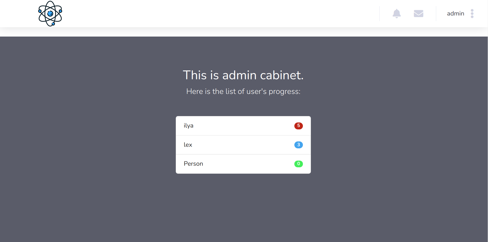

# Бизнес-лаб платформа

## Запуск

В отдельной ветке WebApp лежит сервис, написанный на **django**. Для запуска требуется зайти в корневую папку и запустить 

    python3 manage.py runserver
Далее зайти на `localhost:8000` и можно пользоваться.

## Описание веб сервиса
Сайт обладает следующей функциональностью:

 - Публикация бизнес идей 
 - Создание обучающих курсов 
 - Отслеживание прогресса участников через портал админа 
 - Возможность связаться с участником проекта
 - Цветная подсветка участников разных уровней
 

