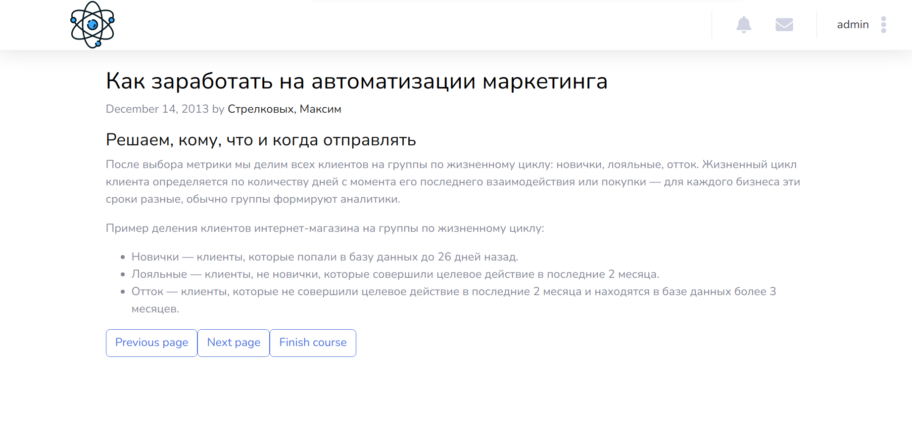

# Business-lab platform

## Running the project

To run the project, navigate to the root folder and execute:

    python3 manage.py runserver
Then go to `localhost:8000` and you can start using it.

## Web Service Description
The website has the following functionality:

 - Publishing business ideas 
 - Creating educational courses 
 - Tracking participant progress through the admin portal 
 - Ability to contact project participants
 - Color highlighting for participants of different levels
 

